# Stock Prediction via Transformers and Time Vectors 

    
    
    
    
    
    

## Here I include the additional images obtained from training/prediction.

---
Train and validation loss for the best performing models

---
## My model 32 days input sequence with some of the best predictions with 1 layer

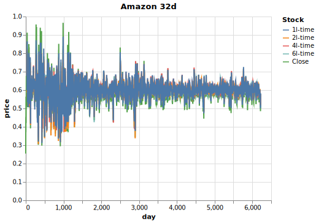
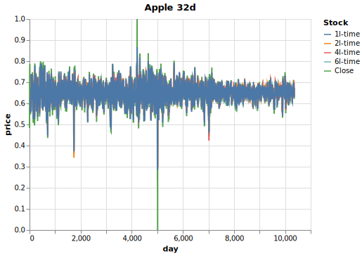
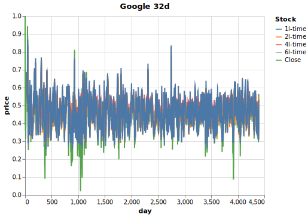
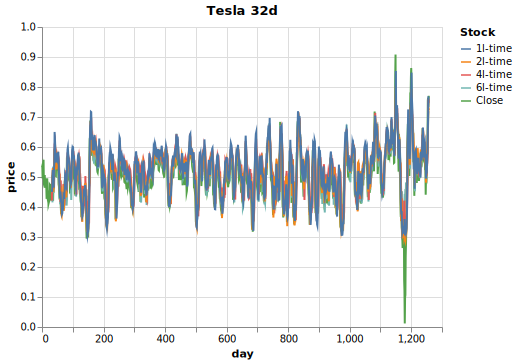

---
## My model 64 days input sequence with some of the best predictions with 2 layer
We can actually see that at 4 and 6 layers the predictions collapses to a constant value.

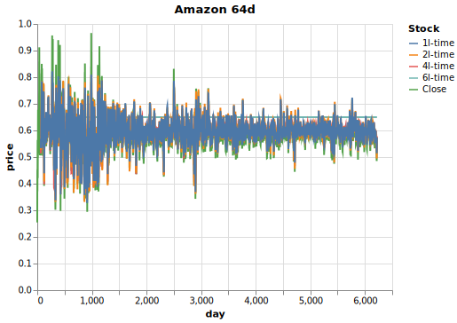
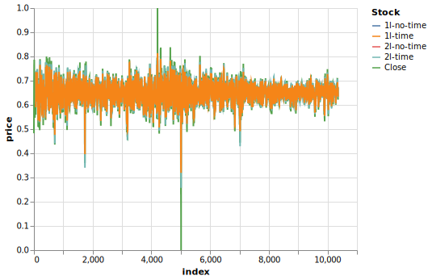
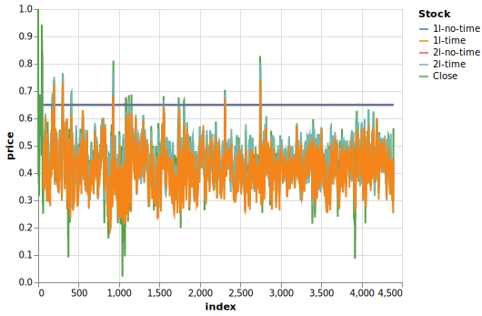
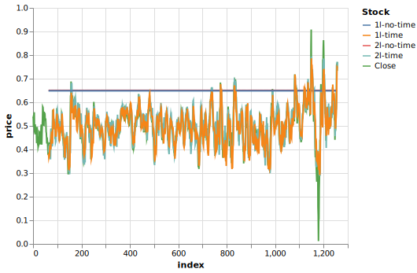

---
## My model 128 days input sequence.
We can actually see that at 4 and 6 layers the predictions collapses to a constant value.

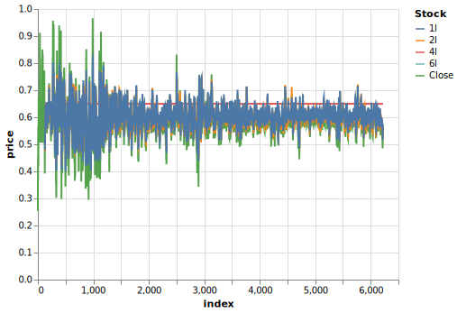
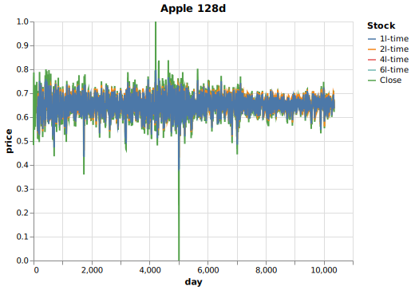
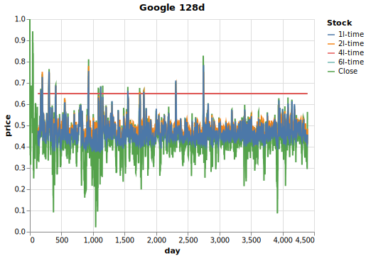
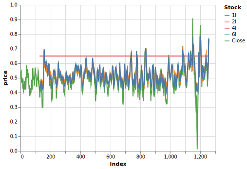

---
## Naive LSTM 32 days input sequence

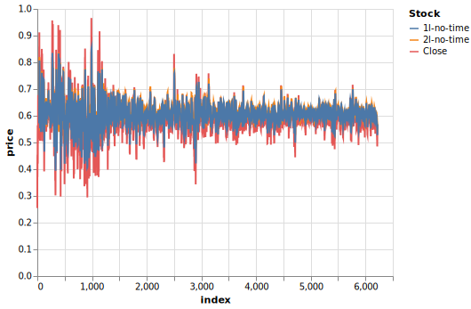
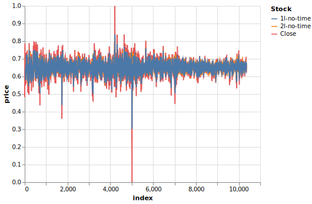
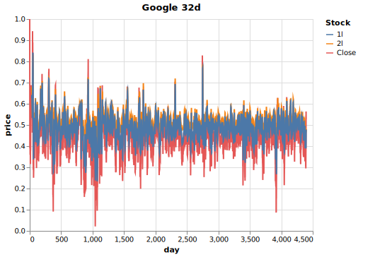
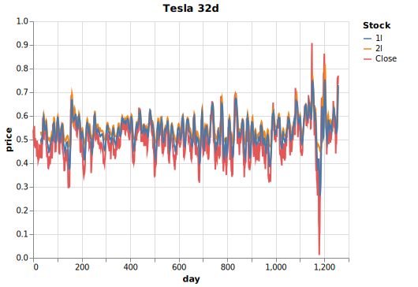

---
## Naive LSTM 32 days input sequence

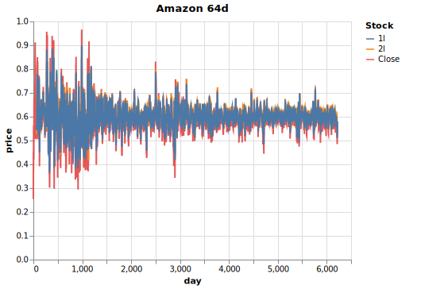
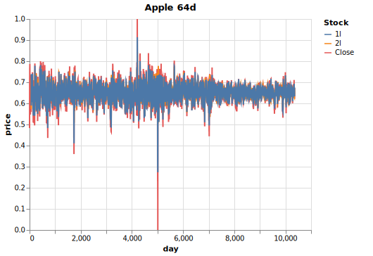
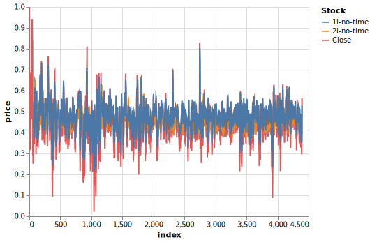
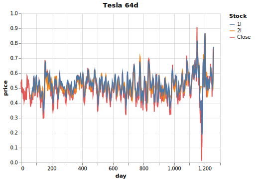

